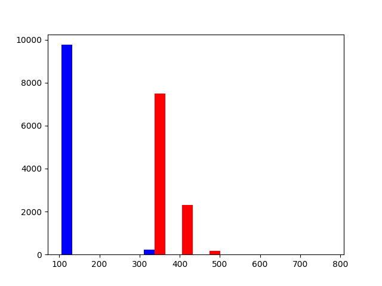

# cache_hit_timing

In red are the 10 0000 values of time to access a pointer in the DRAM. the pointer has been accessed only one time in the program.  
In blue are the 10 000 values of time to access a pointer in the cache. The pointer has been accessed 100 times before the measure.  