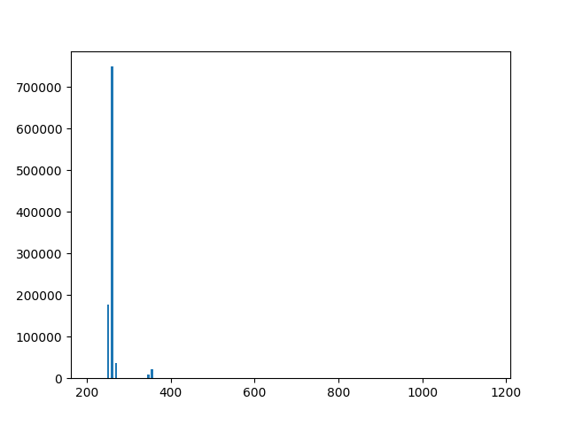

# cache_hit_measure

In red are the 10 0000 values of time to access a pointer in the DRAM. The pointer has been accessed only one time in the program.  
In blue are the 10 000 values of time to access a pointer in the cache. The pointer has been accessed 100 times before the measure.  

# same_bank_measure

The code access to two values in a tab and measure the time to switch between these two values.
This histogram shows the mean value of 20 measures of time to switch between two values. 

The value of time under 300 correspond to a situation where the two values are not in the same bank. 
Otherwise, the value of time above 300 is a situation where the two values are in the same bank. 